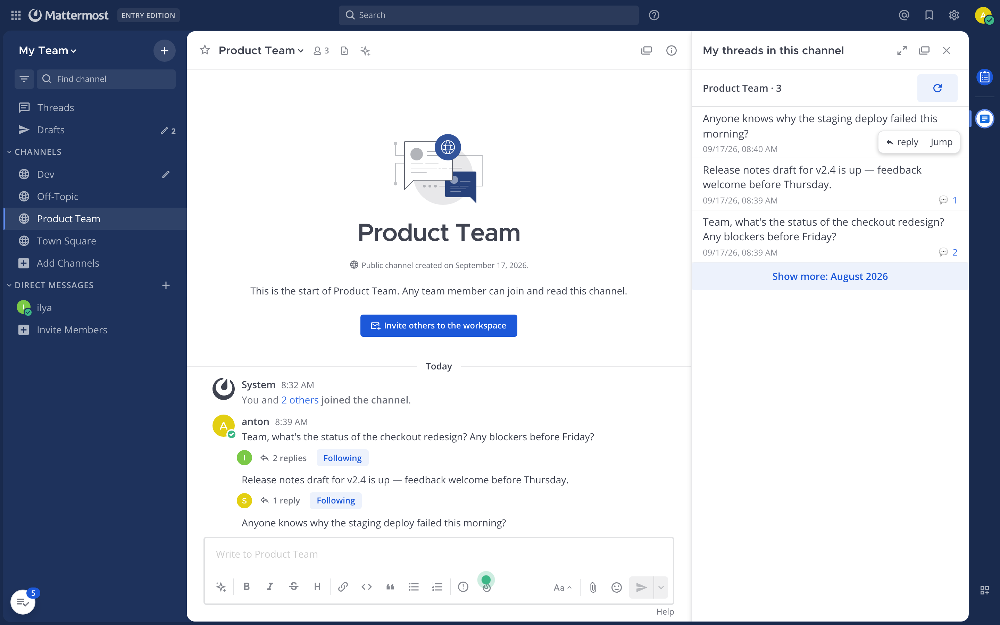

<div align="center">

# Only My Threads [](https://github.com/arxell/mattermost-plugin-only-my-threads/releases/latest) [](https://github.com/arxell/mattermost-plugin-only-my-threads/actions/workflows/ci.yml)

A Mattermost plugin that shows **the threads of the current channel that you started** — in a right-hand panel, including messages nobody has replied to yet.

</div>



Based on the official [mattermost-plugin-starter-template](https://github.com/mattermost/mattermost-plugin-starter-template).

## Key Features

- **Your threads only** — lists the threads of the current channel whose first message is yours, including unreplied messages.
- **Anyone's threads** — a header picker switches the list to the threads any channel member started: avatars, search by nickname or real name, one request for the member list.
- **Awaiting reply at a glance** — unreplied messages are marked with ⏳, so you always see where you are waiting for an answer.
- **Reply in place** — any thread opens in the right-hand sidebar with the reply composer, exactly like Saved Messages.
- **Jump to the channel** — permalink navigation scrolls the channel to the post and highlights it.
- **Month pagination** — only the current month is loaded; older months load on demand and empty months are skipped, so the cost never depends on channel volume.
- **EN, RU, FR and DE localization**, live refresh on new messages, works in the web and desktop apps.

## Quick Start

1. Click the Only My Threads icon in the App Bar (the vertical strip at the right edge of the window).
2. The panel lists your threads in the current channel; hover a row for actions.
3. **Reply** opens the thread with the composer; **Jump** scrolls the channel to the post.
4. Use the "Show more: {month}" button to page back through older threads.
5. Pick a channel member in the header dropdown to browse **their** threads instead of yours; "My threads" brings the list back.

## Server requirements

- **Mattermost Server ≥ 6.2** — the minimum declared in the manifest (`min_server_version: 6.2.1`): all the APIs used (search with `from/in/after/before` filters, the Threads API for reply counts, the webapp extension registry) are available from these versions on.
- **Tested on v11.9 and v11.11** — the plugin has been exercised end to end on both, including the panel, month pagination and opening a thread in the RHS.
- **Search must be enabled** (the stock database search or Elasticsearch — both work; enabled by default). Without it a fallback mode works — a one-off read of the channel stream without month pagination.
- **The Threads feature** (System Console → Experimental → Threads; enabled by default) — required for reply counts and the "awaiting reply" list. Without it the "⏳ awaiting reply" item disappears from the data.
- **App Bar** (v7.1+): the plugin icon lives on the vertical bar on the right. On older servers the button automatically appears in the channel header — no functional degradation.
- Nothing is required from the user except channel membership: no admin rights, tokens or plugin settings.

## Installation

1. Download the latest `only-my-threads-<version>.tar.gz` from the [releases page](https://github.com/arxell/mattermost-plugin-only-my-threads/releases).
2. The server admin enables plugin uploads: **System Console → Plugins → Plugin Management → Enable Plugin Uploads** (if disabled yet) and enables **Enable Plugins**.
3. **System Console → Plugins → Plugin Management → Upload Plugin** → pick the downloaded bundle.
4. Find **Only My Threads** in the plugin list and click **Enable**.
5. Reload the Mattermost client (Ctrl/Cmd+R).

There is no server part (webapp only); no tokens or settings are needed — the client talks to the API from your session.

## Development

### Prerequisites

- Node.js 18+
- Go (for the template's build tooling)
- Docker (with [colima](https://github.com/abiosoft/colima) on Apple Silicon — the official Mattermost images are amd64-only) — only for the local test server

### Build

```bash
make dist        # builds the webapp and packs dist/only-my-threads-<version>.tar.gz
```

Useful commands in `webapp/`:

```bash
npm ci           # install dependencies
npm run lint     # ESLint
npx tsc          # type check
npm run build    # webapp bundle only (webapp/dist/main.js)
npm test         # unit tests
```

Run `make help` in the repository root for the full list of make targets.

### Local test server

`local-server/` contains a docker compose setup (PostgreSQL + Mattermost) with test data seeds:

```bash
cd local-server && docker compose up -d      # start the server at http://localhost:8065
```

Test accounts: `anton` / `ilya` / `sasha`, password `Passw0rd123!`. Install a freshly built bundle with:

```bash
docker cp dist/only-my-threads-<v>.tar.gz local-server-app-1:/tmp/omt.tar.gz
docker exec local-server-app-1 mmctl --local plugin add /tmp/omt.tar.gz --force
```

## How it works

- `webapp/src/index.tsx` — extension registration: the App Bar button (`registerChannelHeaderButtonAction`), the RHS panel (`registerRightHandSidebarComponent`), the reducer and the `posted` websocket handler for auto-refresh.
- `webapp/src/components/rhs.tsx` — the panel: month pagination, states, the list, the Reply/Jump hover toolbar, opening a thread in the RHS (the host's `SELECT_POST` action + preloading), jump to post in the channel.
- `webapp/src/utils/threads.ts` — month pagination via server-side search (`Client4.searchPostsWithParams` with `from/in/after/before` and page-by-page loading of 100 results), per-thread `Client4.getUserThread` requests for counts, and a channel stream fallback scan.
- `webapp/src/i18n/messages.ts` — RU/EN dictionaries.

See [CONTRIBUTING.md](.github/CONTRIBUTING.md) for the contribution workflow and [CHANGELOG.md](CHANGELOG.md) for the version history.

## Limitations

- Awaiting-reply messages and threads are shown for any month you scroll to with the "Show more" button; the depth is not limited.
- The main mode requires server-side search (enabled by default) and the Threads feature; on old servers without them the fallback scan works (a window of the channel's last 1000 posts).
- The panel shows the threads of the channel you are in; switching channels refreshes the list automatically.
- On **v11.9** servers the channel view may "drift" to the recent messages after a Jump (permalink) — that is a Mattermost permalink-view scrolling bug itself (fixed in v11.10 and v11.11: "Fixed an issue with the wrong scroll position in the permalink view of channels with images", "Fixed a scroll issue caused by open graph previews in channel and permalink views"). Not reproducible on v11.11.

## License

Apache 2.0 (inherited from the starter template, see LICENSE).
