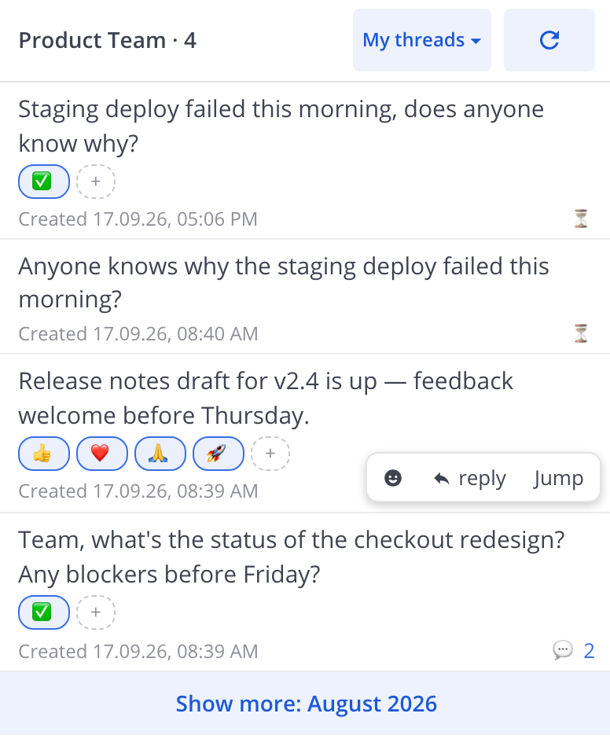

<div align="center">

# Only My Threads [](https://github.com/arxell/mattermost-plugin-only-my-threads/releases/latest) [](https://github.com/arxell/mattermost-plugin-only-my-threads/actions/workflows/ci.yml)

A Mattermost plugin that shows **the threads of the current channel that you started** — in a right-hand panel, including messages nobody has replied to yet.

</div>

Based on the official [mattermost-plugin-starter-template](https://github.com/mattermost/mattermost-plugin-starter-template).

## Features



- **Your threads only** — lists the threads of the current channel whose first message is yours, including unreplied messages.
- **Anyone's threads** — a header picker switches the list to the threads any channel member started: avatars, search by nickname or real name, one request for the member list.
- **Awaiting reply at a glance** — unreplied messages are marked with ⏳, so you always see where you are waiting for an answer.
- **Reply in place** — any thread opens in the right-hand sidebar with the reply composer, exactly like Saved Messages.
- **Jump to the channel** — permalink navigation scrolls the channel to the post and highlights it.
- **Month pagination** — only the current month is loaded; older months load on demand and empty months are skipped, so the cost never depends on channel volume.
- **Reactions in the list** — reaction chips with live updates, and a quick emoji picker on every row.
- **EN, RU, FR and DE localization**, live refresh on new messages, works in the web and desktop apps.

## Quick Start

1. Click the Only My Threads icon in the App Bar (the vertical strip at the right edge of the window).
2. The panel lists your threads in the current channel; hover a row for actions.
3. **Reply** opens the thread with the composer; **Jump** scrolls the channel to the post.
4. Use the "Show more: {month}" button to page back through older threads.
5. Pick a channel member in the header dropdown to browse **their** threads instead of yours; "My threads" brings the list back.

## Requirements

- **Mattermost Server ≥ 6.2.1** — the minimum declared in the manifest (`min_server_version`): all the APIs used (search with `from/in/after/before` filters, batched post fetch, the webapp extension registry) are available from these versions on.
- **Tested on v11.9 and v11.11** — the plugin has been exercised end to end on both, including the panel, month pagination and opening a thread in the RHS.
- **Search must be enabled** (the stock database search or Elasticsearch — both work; enabled by default). Without it a fallback mode works — a one-off read of the channel stream without month pagination.
- **The Threads feature** (System Console → Experimental → Threads; enabled by default) — required for reply counts and the "awaiting reply" list. Without it the "⏳ awaiting reply" item disappears from the data.
- **App Bar** (v7.1+): the plugin icon lives on the vertical bar on the right. On older servers the button automatically appears in the channel header — no functional degradation.
- Nothing is required from the user except channel membership: no admin rights, tokens or plugin settings.

## Installation

### System Console

1. Download the latest `only-my-threads-<version>.tar.gz` from the [releases page](https://github.com/arxell/mattermost-plugin-only-my-threads/releases).
2. Open **System Console → Plugins → Plugin Management** and set **Enable Plugins** and **Enable Plugin Uploads** to `true`.
3. Click **Upload Plugin**, select the downloaded bundle.
4. Find **Only My Threads** in the plugin list and click **Enable**.
5. Reload the Mattermost client (Ctrl/Cmd+R).

### mmctl

```bash
mmctl plugin upload only-my-threads-<version>.tar.gz
mmctl plugin enable only-my-threads
```

There is no server part (webapp only); no tokens or settings are needed — the client talks to the API from your session.

## Development

Prerequisites: Node.js (version from `webapp/.nvmrc`, currently 24), Go (for the template's build tooling), and Docker (with [colima](https://github.com/abiosoft/colima) on Apple Silicon — the official Mattermost images are amd64-only) for the local test server only.

```bash
make check-style   # ESLint + TypeScript type check
make test          # vitest unit tests
make coverage      # vitest with v8 coverage report
make dist          # build the plugin bundle (dist/only-my-threads-<version>.tar.gz)
make deploy        # upload + enable the bundle on $MM_SERVICESETTINGS_SITEURL
```

`webapp/src/manifest.ts` is generated from `plugin.json` — `make apply` regenerates it and is a dependency of every make target above, so never edit the file by hand.

Useful commands in `webapp/`:

```bash
npm ci               # install dependencies
npm run lint         # ESLint
npm run check-types  # type check
npm test             # unit tests
npm run coverage     # tests + v8 coverage
npm run build        # webapp bundle only (webapp/dist/main.js)
```

Run `make help` in the repository root for the full list of make targets.

### Local test server

`local-server/` contains a docker compose setup (PostgreSQL + Mattermost) with test data seeds:

```bash
cd local-server && docker compose up -d      # start the server at http://localhost:8065
```

Test accounts: `anton` / `ilya` / `sasha`, password `Passw0rd123!`. Install a freshly built bundle with `make deploy` (export `MM_SERVICESETTINGS_SITEURL=http://localhost:8065` and `MM_ADMIN_USERNAME`/`MM_ADMIN_PASSWORD`), or by hand:

```bash
docker cp dist/only-my-threads-<v>.tar.gz local-server-app-1:/tmp/omt.tar.gz
docker exec local-server-app-1 mmctl --local plugin add /tmp/omt.tar.gz --force
```

## How it works

- `webapp/src/index.tsx` — extension registration: the App Bar button (`registerChannelHeaderButtonAction`), the RHS panel (`registerRightHandSidebarComponent`), the reducer and the websocket handlers for auto-refresh.
- `webapp/src/components/rhs.tsx` — the panel composition (store selectors, month/author state, fetch effects); the parts live next to it: `ThreadRow.tsx`, `AuthorPicker.tsx`, `ReactionChips.tsx`, `ThreadList.tsx`, `useThreadActions.ts`, `styles.ts`.
- `webapp/src/utils/threads.ts` — month pagination via server-side search (`Client4.searchPostsWithParams` with `from/in/after/before` in day-granularity windows), reply counts and reactions for every root via a single batched `POST /posts/ids` request (chunked by 200), and a channel stream fallback scan.
- `webapp/src/constants.ts` — all the numeric limits (search cap, batch size, month-skip bound, resize delays) with their rationale.
- `webapp/src/i18n/messages.ts` — the EN/RU/FR/DE dictionaries.

See [CONTRIBUTING.md](.github/CONTRIBUTING.md) for the contribution workflow, [CHANGELOG.md](CHANGELOG.md) for the version history, and [docs/api.md](docs/api.md) for the Mattermost APIs the plugin relies on.

## Release process

1. Make sure `plugin.json` `version` matches the release you are about to tag, and the CHANGELOG entry is in place.
2. `make patch` / `make minor` / `make major` bump and tag the version from `main` (the protected branch), or `git tag vX.Y.Z && git push origin vX.Y.Z` by hand — tags are created only on explicit request, never automatically.
3. CI builds the bundle and creates a GitHub release with the tarball attached.

## Limitations

- The plugin builds on Mattermost webapp internals (the raw `SELECT_POST` Redux action, the App Bar/RHS registries). Re-test after every Mattermost upgrade; the verified semantics live in [docs/api.md](docs/api.md).
- The main mode requires server-side search (enabled by default) and the Threads feature; on servers without search the fallback scan works (a window of the channel's last 1000 posts) without month pagination.
- Awaiting-reply messages and threads are shown for any month you scroll to with the "Show more" button; the depth is not limited, but up to 24 empty months in a row are skipped silently.
- A single day holding more than 100 of the listed user's posts in one channel stays truncated at the newest 100 of that day (the search backend cap; see docs/api.md).
- On **v11.9** servers the channel view may "drift" to the recent messages after a Jump (permalink) — that is a Mattermost permalink-view scrolling bug itself (fixed in v11.10 and v11.11). Not reproducible on v11.11.

## License

Apache 2.0 (inherited from the starter template, see LICENSE).
